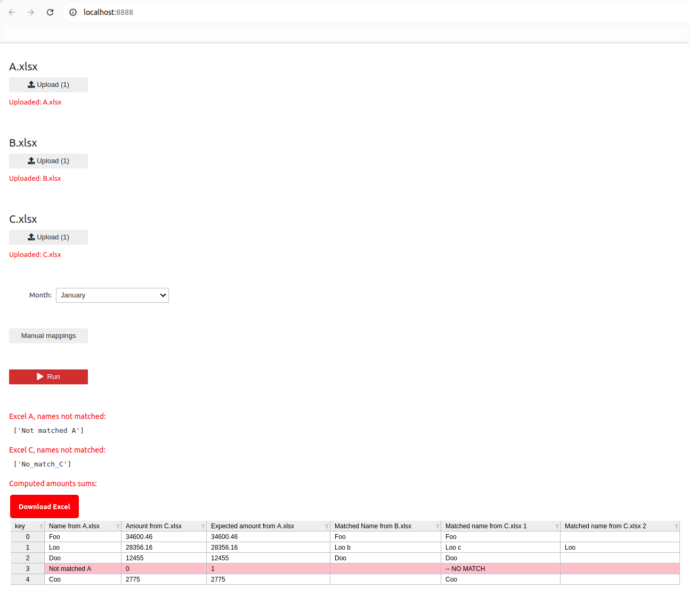

# paymatch-public

To run locally: `bash docker.sh`, then open localhost:8888 in browser

Folder of excels to upload in UI: `excels`

Main python function: function `run()` in `python/notebook.py`

**Goal 1: currently (frontend) + (backend) written in Python only (very fast and easy to write, excellent for fast demo apps). Would be awesome to use AI to automatically split it in a classic design: (frontend using javascript) + (backend REST api using python fastapi), so that better scaling and then frontend devs can take over and improve the UI**

**Goal 2: ask AI to rewrite the current UI in python only, ignore the logic behind the `Run` button (replace the output data with a dummy hardcoded table)**

